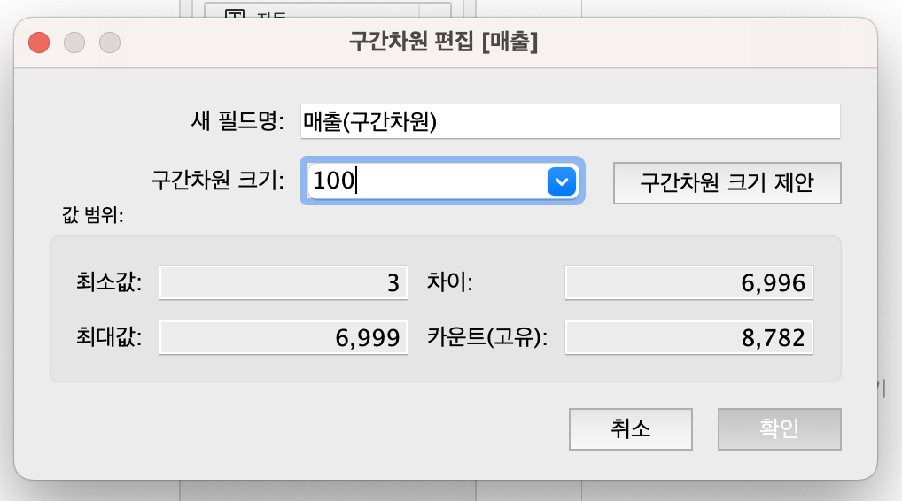
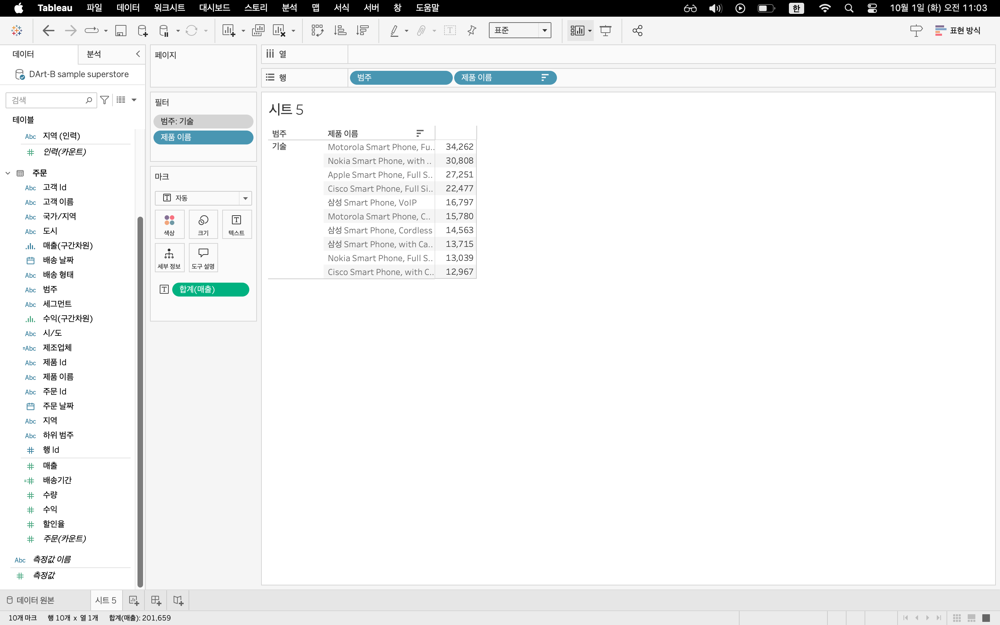

# Third Study Week

- 20강: [파이와 도넛차트](#20강-파이와-도넛차트)

- 21강: [워드와 버블차트](#21강-워드와-버블차트)

- 22강: [이중축과 결합축](#22강-이중축과-결합축)

- 23강: [분산형 차트](#23강-분산형-차트)

- 24강: [히스토그램](#24강-히스토그램)

- 25강: [박스플롯](#25강-박스플롯)

- 26강: [영역차트](#26강-영역차트)

- 27강: [간트차트](#27강-간트차트)

- 28강: [필터](#28강-필터)

- 29강: [그룹](#29강-그룹)


- 문제1 : [문제1](#문제1)

- 문제2 : [문제2](#문제2)

- 참고자료 : [참고자료](#참고-자료)


## Study Schedule

| 강의 범위     | 강의 이수 여부 | 링크                                                                                                        |
|--------------|---------|-----------------------------------------------------------------------------------------------------------|
| 1~9강        |  ✅      | [링크](https://youtu.be/3ovkUe-TP1w?si=CRjj99Qm300unSWt)       |
| 10~19강      | ✅      | [링크](https://www.youtube.com/watch?v=AXkaUrJs-Ko&list=PL87tgIIryGsa5vdz6MsaOEF8PK-YqK3fz&index=75)       |
| 20~29강      | ✅      | [링크](https://www.youtube.com/watch?v=Qcl4l6p-gHM)      |
| 30~39강      | 🍽️      | [링크](https://www.youtube.com/watch?v=e6J0Ljd6h44&list=PL87tgIIryGsa5vdz6MsaOEF8PK-YqK3fz&index=55)       |
| 40~49강      | 🍽️      | [링크](https://www.youtube.com/watch?v=AXkaUrJs-Ko&list=PL87tgIIryGsa5vdz6MsaOEF8PK-YqK3fz&index=45)       |
| 50~59강      | 🍽️      | [링크](https://www.youtube.com/watch?v=AXkaUrJs-Ko&list=PL87tgIIryGsa5vdz6MsaOEF8PK-YqK3fz&index=35)       |
| 60~69강      | 🍽️      | [링크](https://www.youtube.com/watch?v=AXkaUrJs-Ko&list=PL87tgIIryGsa5vdz6MsaOEF8PK-YqK3fz&index=25)       |
| 70~79강      | 🍽️      | [링크](https://www.youtube.com/watch?v=AXkaUrJs-Ko&list=PL87tgIIryGsa5vdz6MsaOEF8PK-YqK3fz&index=15)       |
| 80~89강      | 🍽️      | [링크](https://www.youtube.com/watch?v=AXkaUrJs-Ko&list=PL87tgIIryGsa5vdz6MsaOEF8PK-YqK3fz&index=5)        |


<!-- 여기까진 그대로 둬 주세요-->
<!-- 이 안에 들어오는 텍스트는 주석입니다. -->

# Third Study Week

## 20강: 파이와 도넛차트
<!-- 파이와 도넛차트에 관해 배우게 된 점을 적어주세요 -->
전체에 대한 비율을 표시할 때 주로 사용
실제 값 보다는 구성 비율로 표시하는 것이 한눈에 보기 더 좋다(퀵테이블 계산->구성비율)

> **🧞‍♀️ 도넛차트를 생성하는 법을 기록해주세요.**
이중축을 활용하여 도넛차트 활용
열 선반을 더블클릭해서 0을 임력해 임의의 축 2개 만들기
두번째 마크에 포함된 값을 없애고 레이블에 매출 넣기 사이즈 조정 두개의 분리된 파이 차트를 이중축 설정하여 축 합치면 도넛차트 확인
시트에서 마우스 우클릭하여 시트의 행열 구분선, 0기준선 없애주면 더 깔끔


## 21강: 워드와 버블차트
<!-- 워드와 버블차트에 관해 배우게 된 점을 적어주세요 -->
워드 클라우드: 문서 내에서 등장하는 키워드가 얼마나 자주 등장하는 지를 텍스트 크기로 표현하여 직관적으로 시각화 할 수 있는 차트
(마우스 우클릭 드래그 -> 맥북opt키로 대체 가능)


버블차트: 수치적 데이터를 원의 크기로 표현하는 차트


## 22강: 이중축과 결합축
<!-- 이중축과 결합축에 관해 배우게 된 점을 적어주세요 -->
이중축: 하나의 뷰 안에서 축을 이중으로 사용하는 차트
이중축을 쓸 경우 마크를 각각의 축에 개별적으로 적용할 수 있다.


결합축: 하나의 축을 공유하는 차트
축을 공유하는 측정값을 필요에 따라 추가할 수 있다. 


## 23강: 분산형 차트
<!-- 분산형 차트에 관해 배우게 된 점을 적어주세요 -->
분산형 차트:파라미터 간의 상관관계를 파악하는데 유용한 그래프
 매출 상승에 따른 일반적인 상승 추이와 추세와는 상반되는 제조업체 확인 가능->비즈니스 분석에 사용 가능

SPLIT([제품 이름], ' ', 1)


```js
강의 영상과 달리, 우리 파일에는 '제조 업체' 필드가 없습니다. 필요한 경우, 계산된 필드를 이용해 'SPLIT([제품 이름], ' ', 1)'를 '제조 업체'로 정의하시고 세부 정보에 놓아주세요.
```

## 24강: 히스토그램
<!-- 히스토그램에 관해 배우게 된 점을 적어주세요 -->
히스토그램: 분포 형태를 표시하는 차트
모양은 막대그래프와 비슷하지만 연속형 측정 값을 범위 혹은 구간차원으로 그룹화 한다는 점이 다르다. (양적 데이터)
차원 필드 없이 측정값만으로 그래프를 그릴 때 주로 사용
일정한 크기의 포켓을 만들어 그 안에 값을 담아 표현시키기 위한 도구





카운트(고유) - 중복값 제외

## 25강: 박스플롯
<!-- 박스플롯에 관해 배우게 된 점을 적어주세요 -->
박스플롯: 상자 수염 그림이라고도 불림
다섯개의 구간 범위를 그림으로 표현해 분포와 이상치를 한눈에 볼 수 있어 데이터 전처리와 분포 분석을 통한 인사이트 도출시 많이 사용되는 그래프
안쪽울타리, 1사분위Q1, 중앙값Q2, 3사분위Q3, 바깥울타리
울타리 밖의 값-이상치


## 26강: 영역차트
<!-- 영역차트에 관해 배우게 된 점을 적어주세요 -->
영역차트: 라인과 축 사이의 공간이 색상으로 채워진 차트
주로 연속형 데이터의 누계를 표현하는데 사용됨


## 27강: 간트차트
<!-- 간트차트에 관해 배우게 된 점을 적어주세요 -->
간트차트: 주로 시간 경과에 따른 기간을 시각화하는데 사용

배송기간: 배송날짜-주문날짜


## 28강: 필터
<!-- 필터에 관해 배우게 된 점을 적어주세요 -->
필터: 뷰,쿼리 속도나 용량 측면에서도 필터 핸들링에 따라 성능 차이


추출 -> 필터 사용 시 추출을 새로 저장
데이터 원본필터: 작업을 위한 데이터 중 일부만 워크스페이스에 불러올 때 사용

컨텍스트 필터: 필터 중 상위필터 - 여러 필터 설정 시 다른 필터가 컨텍스트 필터에 종속됨




## 29강: 그룹
<!-- 그룹에 관해 배우게 된 점을 적어주세요 -->
그룹: 데이터를 표시하는 방법. 수동으로 필드에 있는 항목들을 묶을 수 있고 기존 데이터 원본에 없는 사용자 지정 그룹 필드를 만들 수 있다. 


## 문제 1.

```js
유정이는 superstore 데이터셋에서 '주문' 테이블을 보고 있습니다.
1) 국가/지역 - 시/도- 도시 의 계층을 생성했습니다. 계층 이름은 '위치'로 설정하겠습니다.
2) 날짜의 데이터 타입을 '날짜'로 바꾸었습니다.

코로나 시기의 도시별 매출 top10을 확인하고자
1) 배송 날짜가 코로나시기인 2021년, 2022년에 해당하는 데이터를 필터링했고
2) 위치 계층을 행으로 설정해 펼쳐두었습니다.
이때, 매출의 합계가 TOP 10인 도시들만을 보았습니다.
```


```
겉보기에는 전체 10개로, 잘 나온 결과처럼 보입니다. 그러나 유정이는 치명적인 실수를 저질렀습니다.
오늘 배운 '컨텍스트 필터'의 내용을 고려하여 올바른 풀이 및 결과를 구해주세요.
```

<!-- DArt-B superstore가 아닌 개인 superstore 파일을 사용했다면 값이 다르게 표시될 수 있습니다.-->
.png)
.png)
.png)
두개의 필터를 사용하게 되면 독립적으로 작동하므로 배송날짜 전체 기간 중 매출합계액 상위10개를 산출해낸다.
2020, 2021년의 상위 10개 매출 데이터만을 필터링 하기 위해서는 배송날짜를 컨텍스트 필터로 설정해야 한다. 

## 문제 2.

```js
태영이는 관심이 있는 제품사들이 있습니다. '제품 이름' 필드에서 '삼성'으로 시작하는 제품들을 'Samsung group'으로, 'Apple'으로 시작하는 제품들을 'Apple group'으로, 'Canon'으로 시작하는 제품들을 'Canon group'으로, 'HP'로 시작하는 제품들을 'HP group', 'Logitech'으로 시작하는 제품들을 'Logitech group'으로 그룹화해서 보려고 합니다. 나머지는 기타로 설정해주세요. 이 그룹화를 명명하는 필드는 'Product Name Group'으로 설정해주세요.

(이때, 드래그보다는 멤버 찾기 > 시작 문자 설정하여 모두 찾아 한번에 그룹화해 확인해보세요.)
```


```js
해당 그룹별로 어떤 국가/지역이 주문을 많이 차지하는지를 보고자 합니다. 매출액보다는 주문량을 보고 싶으므로, 주문Id의 카운트로 계산하겠습니다.

기타를 제외하고 지정한 5개의 그룹 하위 목들만을 이용해 아래와 같이 지역별 누적 막대그래프를 그려봐주세요.
```


.png)
.png)
